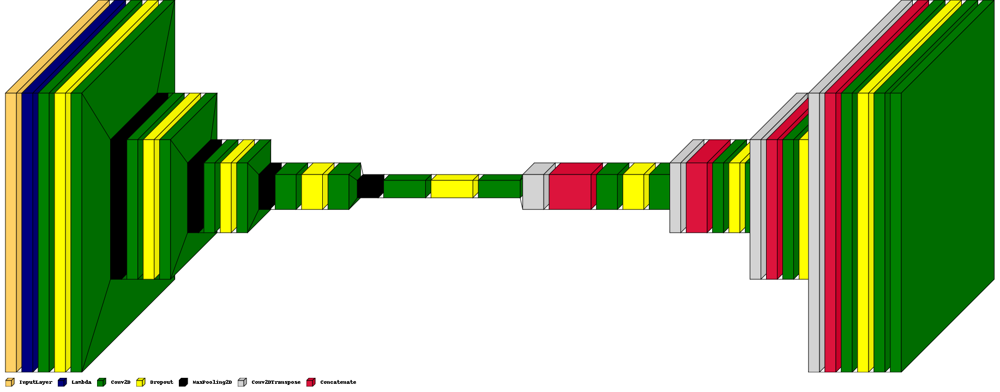

# Computer Vision for biomedical images processing

[](https://zenodo.org/badge/latestdoi/286538177)

```
@software{estera_kot_2020_5091735,
  author       = {Estera Kot},
  title        = {Computer Vision for Biomedical Images Processing},
  month        = aug,
  year         = 2020,
  publisher    = {Zenodo},
  version      = {2.0},
  doi          = {10.5281/zenodo.5091735},
  url          = {https://doi.org/10.5281/zenodo.5091735}
}
```

## Brain Tumours (Glioma) augmentation with AugLy - original image and ground truth mask augmented together 


## U-Net TF2 Keras Arch


